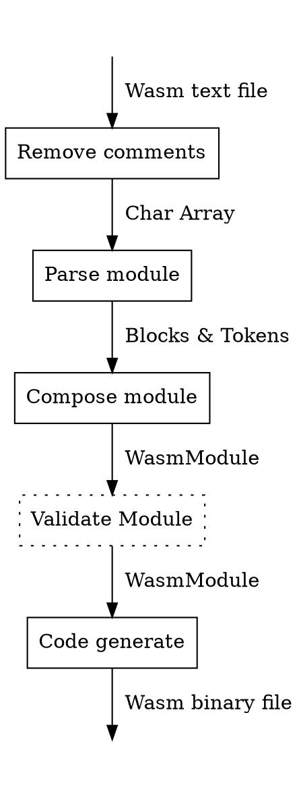

# Wass

WebAssembly assembler for WasmVM

# Quick start

TODO:

# Design

## Assembling process

## Remove comments

Feature:

* Match single-line comment
* Match block-comment
* Ignore non-comment characters

Error:

* Unmatched block-end parentheses
    * SyntaxError

## Parse module

Feature:

* Match parentheses-wrapped block
* Match block name
* Match identifiers
* Match string literal
* Match integer literal
* Match floating-point literal
* Build syntax tree according to each module

Error:

Several SyntaxErrors

## Compose module

Feature:

* Merge sections into one instance
* Analyze semantics and compose to WasmModule

Error:

Several SemanticErrors

## [Later] Validate module

Feature: 

* Validate WasmModule according to official validation algorithm

Error:

Several ModuleErrors

## Code generate

Feature:

* Generate WebAssembly binary code from WasmModule

## Misc

### File IO

* Read file
* Write file

### Command-line
* Option parser

### Test

#### Unit test

* Using gtest

#### Regression

* Generated from `WasmVM/testsuite`
* Remove `return`, `trap`
* Ignore `invalid` until validation being developed in the future